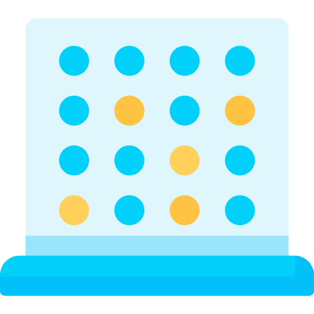

#  The Connect-4 Game Assignment
In this assignment, you will implement the complete logic behind the "Connect 4 Game" including the artificial Intelligence part of the computer player.
Please read the assignment carefully before proceeding. You can find the assignment [here](https://drive.google.com/file/d/1qlqLBfI3Xu0p_BXRNbRneMWtyLlakXGp/view?usp=sharing).
In case if you have any doubts regarding the assignment please make sure to clarify them upfront.

### How to use this repo
* `git clone https://github.com/Ranjith-Suranga/connect-four-game-assignment.git`
* Open the `pom.xml` via IntelliJ IDEA
* Make sure to the open it as a project, if prompt
* Reload the `pom.xml` file via **Maven Tool Window**
* Create a run configuration for Maven via `Run > Edit Configuration`
* Add `javafx:run` as the `Run` command
* That's it. 
* **But do not try to run or compile the application yet**
* **Follow the instructions in the assignment**

### FAQ

**Q: Can I delete the `.gitkeep` file in `lk.ijse.dep.service` package?** 
Yes, you can

**Q: Why can't I run any games that are in the release page?** 
Open a terminal window and type `java -version` to find out the java version. You should have JDK 11 installed on your system to run these games. If you have JDK 11 installed on your system and still unable to run the games, then seek your course instructor's help to get it work. 

**Q: I have found some broken links and spelling mistakes in the assignment. How can I inform?** 
Please open a [new issue](https://github.com/Ranjith-Suranga/connect-four-game-assignment/issues/new) mentioning the broken link or spelling mistake. Thank you for informing!

**Q: I have doubts to clarify regarding the assignment, what should I do?** 
Please contact your course instructor 😉

### Game
If you want to find out how the game looks like at the end of each step, check out the [release page](https://github.com/Ranjith-Suranga/connect-four-game-assignment/releases) and follow the instructions there.

### Version
0.0.5

### License
Copyright © 2022 DEP. All rights reserved  
This project is licensed under the [MIT](LICENSE.txt) License.